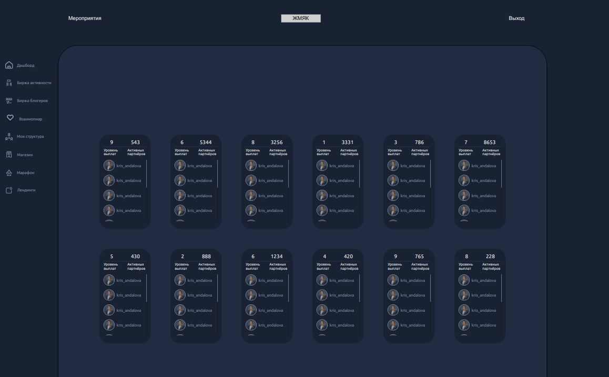
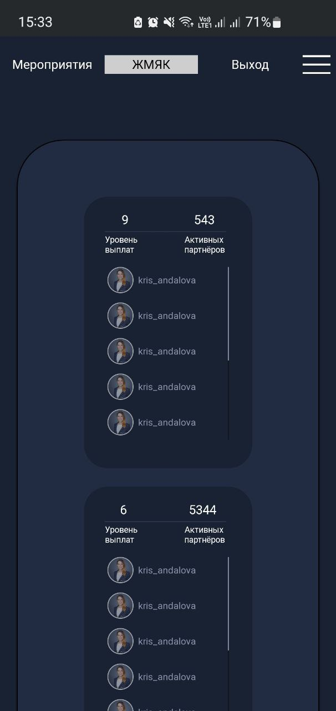
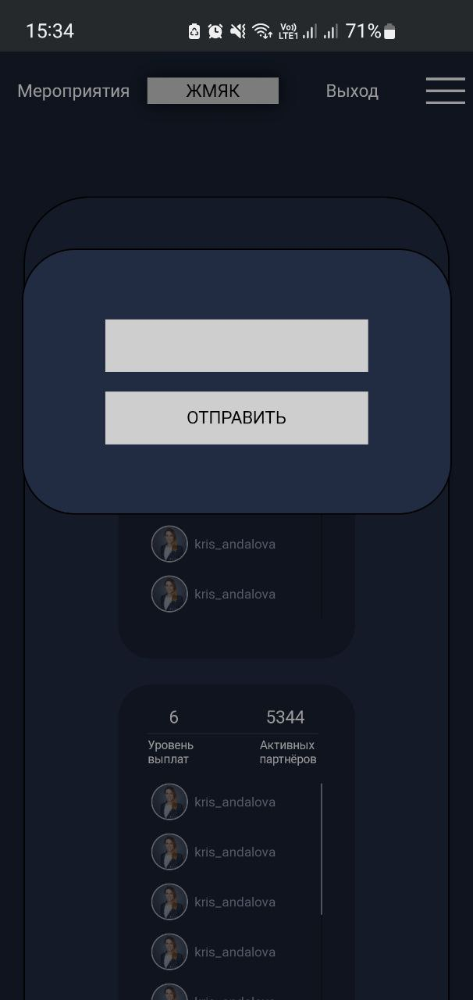
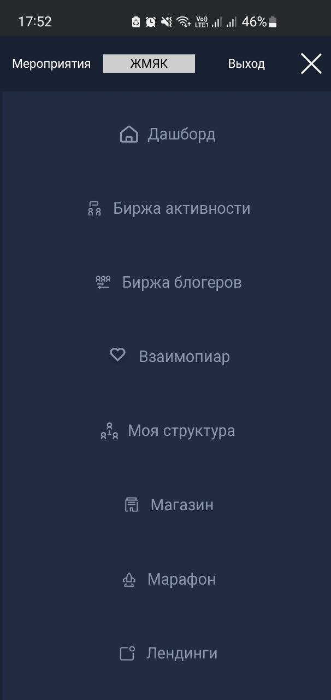

### Тестовое задание 

Нужно было сверстать страницу по макету из [Figma](https://www.figma.com/file/inVmL0NDlejkhXsoq7lsjS/%D0%A2%D0%B5%D1%81%D1%82%D0%BE%D0%B2%D0%BE%D0%B5-%D0%B7%D0%B0%D0%B4%D0%B0%D0%BD%D0%B8%D0%B5?node-id=2991%3A7478)

А так же добавить верстку под мобилку, кнопку в шапке для модалки и меню бургер.

Проверить можно запустив приложение через команду `npm start` либо перейти [по ссылке](https://adaptivetestq.herokuapp.com/) и попробовать там
